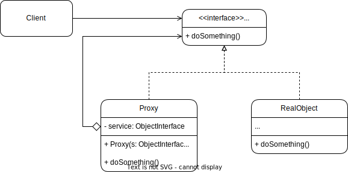
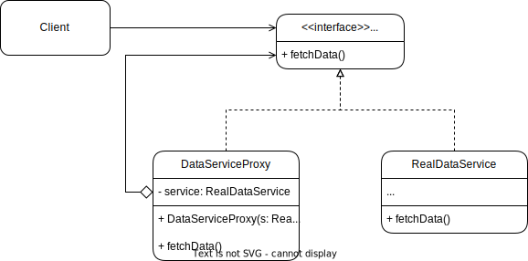

Proxy is a **structural pattern** that lets you put a placeholder between the clients and a real object.

## Problem
Imagine an application where there's a client that communicates with an object that's very heavy in terms of resources. You may want to implement lazy loading but it could lead to code duplication.
Alternatively, the object might require pre-processing or post-processing.

## Solution
This is where the **proxy pattern** comes into play.
With this pattern, the client interacts with the proxy, which then communicates with the real object, potentially performing additional tasks before returning the result to the client.

In this scenario, there are three key components: the client, the proxy, and the real object. Both the proxy and the real object should implement the same interface, ensuring that the client remains unaware of which object it is communicating with.




## Real-World example
Imagine you have a remote service that fetches data from a server. Accessing this service might be slow or expensive, so you want to add some logging to see when it's being accessed. Instead of modifying the service itself, you can use a proxy to handle the logging.


## Java example
```java
// The interface of a remote service
interface DataService { 
	String fetchData(); 
}

// The concrete implementation of a real remote service
class RealDataService implements DataService {
    @Override
    public String fetchData() {
        // Simulate a delay as if fetching data from a remote server
        try {
            Thread.sleep(2000); // 2-second delay
        } catch (InterruptedException e) {
            e.printStackTrace();
        }
        return "Data from remote server";
    }
}


// the concrete implementation of a remote service proxy, with added logging
class DataServiceProxy implements DataService {
    private RealDataService realDataService;

    public DataServiceProxy() {
        this.realDataService = new RealDataService();
    }

    @Override
    public String fetchData() {
        System.out.println("Logging: Fetching data from remote server...");
        String data = realDataService.fetchData();
        System.out.println("Logging: Data fetched successfully.");
        return data;
    }
}

// The client code
public class Main {
    public static void main(String[] args) {
        DataService dataService = new DataServiceProxy();
        
        // Fetch data using the proxy
        System.out.println("Client: Requesting data...");
        String data = dataService.fetchData();
        System.out.println("Client: Received data -> " + data);
    }
}

```

## Applications
The proxy pattern can be applied in various ways:

- **Remote Proxy**: When the real object is located remotely, and the proxy makes a remote call to fetch it.
- **Virtual Proxy**: When you want to lazily load a resource-intensive object.
- **Protection Proxy**: When you need to perform security checks before interacting with or returning the real object.
- **Caching Proxy**: When you need to cache the real object to avoid fetching it repeatedly.
- **Logging Proxy**: When you need to add logging before or after interacting with the real object.

## Tips
* It is not always possible to extract a common interface from a pre-existing class, especially if doing so requires altering all client code or if the class belongs to a third-party library. In the first case, consider making the proxy a subclass. In the latter case, consider using the adapter pattern.