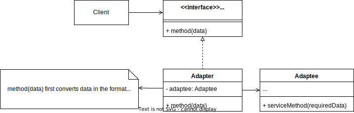

Adapter is a **structural design pattern** that enables one component to work with another that has an incompatible interface.
## Problem
In software development, you might encounter situations where a component needs to collaborate with another that has a completely incompatible interface. Often, this incompatibility arises because the component is part of a third-party library or legacy code that cannot be modified.
## Solution
This is where the Adapter pattern becomes useful. You can create an **adapter** that converts the data or interface from one format to another, allowing the components to communicate effectively. For instance, you can build an adapter that converts XML data into JSON and passes it to a library that only understands JSON.

In this scenario, the main actors are the adapter and the adaptee. They do not—and cannot—share a common interface.



## Real-World example
Imagine you're developing an application that needs to measure temperature. You have a remote sensor that provides temperature readings in Celsius, but your application uses a library that only works with Fahrenheit. Since you cannot modify the library to accept Celsius, you need a way to convert the temperature readings before passing them to the library.

In this scenario, you can create an adapter that converts the Celsius readings from the sensor into Fahrenheit, allowing your application to work seamlessly with the existing library.

## Java example
```java
// adaptee
class CelsiusThermometer {
    public double getTemperature() {
        return 25.0; // returns temperature in Celsius
    }
}

// adapter
class TemperatureAdapter implements FahrenheitThermometer {
    private CelsiusThermometer celsiusThermometer;

    public TemperatureAdapter(CelsiusThermometer celsiusThermometer) {
        this.celsiusThermometer = celsiusThermometer;
    }

    @Override
    public double getTemperatureInFahrenheit() {
        double celsius = celsiusThermometer.getTemperature();
        return celsius * 9 / 5 + 32; // Convert to Fahrenheit
    }
}

// client interface
interface FahrenheitThermometer {
    double getTemperatureInFahrenheit();
}

// client code
public class Main {
    public static void main(String[] args) {
        CelsiusThermometer celsiusThermometer = new CelsiusThermometer();
        FahrenheitThermometer fahrenheitThermometer = new TemperatureAdapter(celsiusThermometer);
        
        System.out.println("Temperature in Fahrenheit: " + fahrenheitThermometer.getTemperatureInFahrenheit());
    }
}

```
## Applications
You can use the Adapter pattern in the following situations:

- When you want to reuse legacy subclasses that lack certain functionality, and you cannot modify the superclass.
    
    > Extending these subclasses might lead to code duplication and violate clean code principles.
    
- When you need to interact with a third-party library that functions differently from your codebase.

