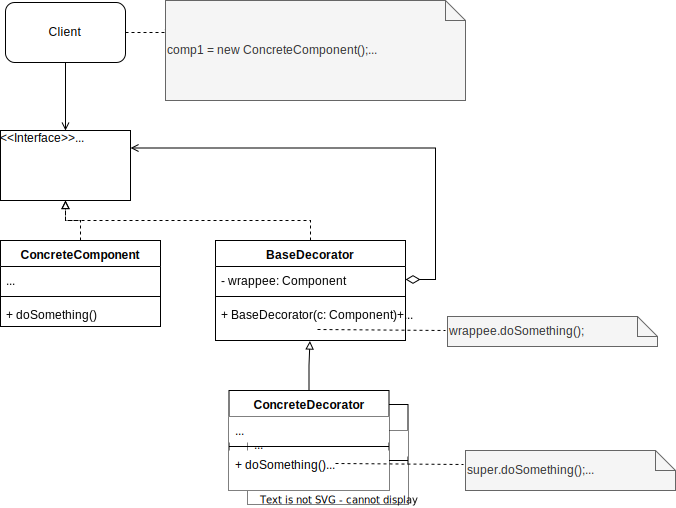

The Decorator is a **structural design pattern** that allows you to add new functionalities to existing objects by wrapping them in new classes.
## Problem
When working on a project, a scenario in which you need to add and combine different functionalities can happen. 
The first approach to solve this problem could be creating a set of subclasses for each functionality, and this could work for a small set of classes.
But what if you need to add and combine a hundred different functionalities? The possible combination are really too much.
Furthermore, inheritance is static and changing behavior at runtime would be impossible.
## Solution
That's where the **decorator pattern** comes into play.
It lets you wrap an object in a class that implements the same contract as the wrapped object, effectively "decorating" the object with new functionalities.
The key advantages of this approach include:
* **Flexibility**: you can add new functionalities without modifying the existing code
* **Reusability**: decorators can be combined in different ways to create complex scenarios
* **Single responsibility principle**: each decorator adds only the set of concerns it needs


## Real-World example
In a typical software application, you might have a notification system that sends out alerts, updates, or messages to users. This system could start simple, just sending plain notifications. However, as the application grows, new requirements often emerge, such as:

1. **Multiple Delivery Channels**: Users might want to receive notifications via different channels, such as email, SMS, or even push notifications.
2. **Message Formatting**: Depending on the target channel or user preference, notifications might need to be formatted differently. For instance, JSON or XML formats might be needed for integrations, or plain text might suffice for others.
3. **Logging and Monitoring**: To ensure that notifications are sent correctly and to troubleshoot issues, logging every notification becomes necessary.
4. **Security Features**: Adding encryption or signing of messages for security purposes might also become a requirement.
5. **Customizable Behavior**: Different types of notifications (e.g., alerts, promotions, reminders) may need specific handling or extra processing.

Building all these features directly into a single notification class would make the class complex, hard to maintain, and less flexible. Moreover, using inheritance to handle these variations would result in an explosion of subclasses, each representing a combination of features, leading to a rigid and tangled class hierarchy.
## Java example
```java
// Component Interface
interface Notifier {
    void send(String message);
}

// Concrete Component
class BasicNotifier implements Notifier {
    @Override
    public void send(String message) {
        System.out.println("Sending basic notification: " + message);
    }
}

// Decorator Class
abstract class NotifierDecorator implements Notifier {
    protected Notifier wrappedNotifier;

    public NotifierDecorator(Notifier notifier) {
        this.wrappedNotifier = notifier;
    }

    @Override
    public void send(String message) {
        wrappedNotifier.send(message);
    }
}

// Concrete Decorators
class EmailNotifier extends NotifierDecorator {
    public EmailNotifier(Notifier notifier) {
        super(notifier);
    }

    @Override
    public void send(String message) {
        super.send(message);
        System.out.println("Sending email notification: " + message);
    }
}

class SMSNotifier extends NotifierDecorator {
    public SMSNotifier(Notifier notifier) {
        super(notifier);
    }

    @Override
    public void send(String message) {
        super.send(message);
        System.out.println("Sending SMS notification: " + message);
    }
}

class LoggingNotifier extends NotifierDecorator {
    public LoggingNotifier(Notifier notifier) {
        super(notifier);
    }

    @Override
    public void send(String message) {
        super.send(message);
        log(message);
    }

    private void log(String message) {
        System.out.println("Logging notification: " + message);
    }
}

class JsonFormatNotifier extends NotifierDecorator {
    public JsonFormatNotifier(Notifier notifier) {
        super(notifier);
    }

    @Override
    public void send(String message) {
        String jsonMessage = "{ \"message\": \"" + message + "\" }";
        super.send(jsonMessage);
    }
}

// Client code
public class NotificationSystem {
    public static void main(String[] args) {
    
        Notifier notifier = new BasicNotifier();

        notifier = new EmailNotifier(notifier);

        notifier = new SMSNotifier(notifier);

        notifier = new LoggingNotifier(notifier);

        notifier = new JsonFormatNotifier(notifier);

        notifier.send("Hello, Decorator Pattern!");
    }
}
```
## Applications
Use the **decorator pattern** when these cases occur:
- **Stream and I/O Operations**: Enhancing streams with buffering, encryption, or compression.
- **Logging Systems**: Adding logging functionality around method calls or operations.
- **File and Data Processing**: Applying filters, transformations, or validations to data streams.
- **Notification Systems**: Extending notifications with email, SMS, logging, and formatting features.
- **Serialization**: Converting objects to formats like JSON, XML, or CSV dynamically.
- **Dynamic Feature Toggling**: Enabling or disabling features at runtime without modifying core code.
- **Error Handling**: Wrapping operations with error handling, retries, or fallbacks.