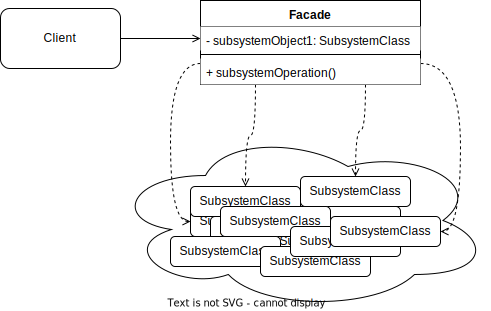

Facade is a **structural design pattern** that let's you interact with complex systems through a simpler interface.
## Problem
In software development, is often necessary to interact with complex systems composed of different interdependent classes and usually you don't need to use all of them, but only a small subset.
You probably also want to avoid tight coupling with those classes as it would make difficult to make future changes.
## Solution
This is where the **Facade** pattern proves useful.
By providing a unified interface, the facade allows clients to interact with the system using only the subset of functionality they need, while hiding the complexities of the underlying subsystem.
This enhances both decoupling and simplicity.



## Real-World example
Imagine a software that uses different logging mechanisms:
- **File Logging** for saving logs to a file.
- **Console Logging** for outputting logs to the console.
- **Remote Server Logging** for sending logs to a remote server.
Each logging mechanism might involve different classes and methods. Managing and using all these logging mechanisms directly can be complex and cumbersome.

You can use the **Facade Pattern** to provide a simplified interface for logging.
The **facade** will handle the complexities of interacting with different logging mechanisms and provide a unified way to log messages.
## Java example
```java
// SUBSYSTEM CLASSES
// File logging subsystem
class FileLogger {
    public void logToFile(String message) {
        System.out.println("Logging to file: " + message);
    }
}

// Console logging subsystem
class ConsoleLogger {
    public void logToConsole(String message) {
        System.out.println("Logging to console: " + message);
    }
}

// Remote server logging subsystem
class RemoteServerLogger {
    public void logToServer(String message) {
        System.out.println("Sending log to remote server: " + message);
    }
}


// FACADE CLASS
class LoggerFacade {
    private FileLogger fileLogger;
    private ConsoleLogger consoleLogger;
    private RemoteServerLogger remoteServerLogger;

    public LoggerFacade() {
        this.fileLogger = new FileLogger();
        this.consoleLogger = new ConsoleLogger();
        this.remoteServerLogger = new RemoteServerLogger();
    }

    public void log(String message) {
        fileLogger.logToFile(message);
        consoleLogger.logToConsole(message);
        remoteServerLogger.logToServer(message);
        System.out.println("Log message processed.");
    }
}

// CLIENT CODE
public class Main {
    public static void main(String[] args) {
        LoggerFacade logger = new LoggerFacade();
        logger.log("This is a log message."); // Unified logging
    }
}

// CLIENT CODE WITHOUT FACADE
public class Main {
    public static void main(String[] args) {
        // Create instances of each logging subsystem
        FileLogger fileLogger = new FileLogger();
        ConsoleLogger consoleLogger = new ConsoleLogger();
        RemoteServerLogger remoteServerLogger = new RemoteServerLogger();

        // Log a message using all the logging mechanisms
        String message = "This is a log message.";

        fileLogger.logToFile(message);
        consoleLogger.logToConsole(message);
        remoteServerLogger.logToServer(message);

        System.out.println("Log message processed.");
    }
}

```

As you can see from the example above, the client code without **facade** is more complex even using just three classes, imagine what could happen with way more classes.
## Applications
You can use **facade** in such scenarios:
* You need a limited subset of functionalities from a complex system
* You want to organize  a subsystem into distinct logical layers
