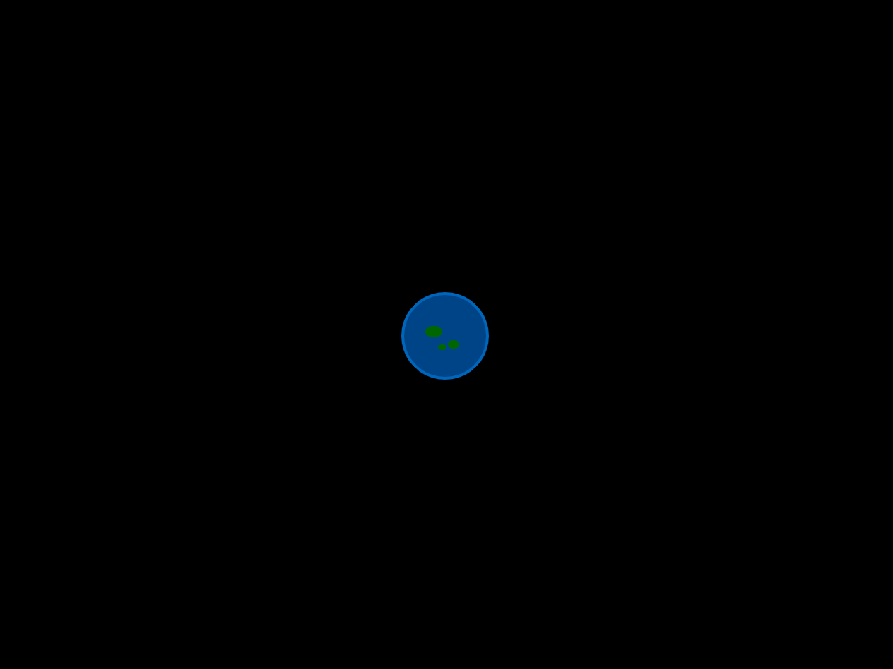
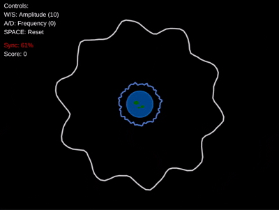
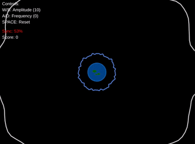

This year again, as every November since 2012, [GitHub Game Off](https://itch.io/jam/game-off-2025) takes place, the game jam organized by GitHub where you have to develop a video game on a specific theme within a month.
This year I decided to participate with the excuse of practicing with JavaScript (specifically I chose to use [p5.js](https://p5js.org/), but this might change if I see it doesn't quite suit my needs).

## The theme

This year's theme is **waves** (quoting from the jam page)

> **wave /weɪv/**
>
> **Noun**
>
> - A moving ridge on the surface of a liquid (for example, ocean waves or coffee ripples).
> - A repeating pattern of motion, energy, or sound (for example, sound waves or radio waves).
> - A sudden burst or surge (for example, a wave of enemies or a wave of emotion).
> - A gesture of greeting or farewell.
>
> **Verb**
>
> - To move your hand in greeting or farewell.
> - To undulate or fluctuate (for example, wheat waving in the wind).
> - To signal or summon (for example, waving someone through a door).
>
> **Adjective**
>
> - Flowing, wavy, or oscillating (for example, wavy hair).
>
> **Acronyms (OK, we made these up)**
>
> - Wizards Accelerating Velocity Every Sunday
> - Warriors Against Variable Energy Surges
> - Whales And Vikings Engaging Submarines
> - Or make up your own—we love seeing how creative you get with it!

## My idea

As a space and astrophysics enthusiast, the word "waves" immediately brought [gravitational waves](https://en.wikipedia.org/wiki/Gravitational_wave) to mind, so why not create a mini puzzle game where you have to save Earth from malicious gravitational waves (whatever that means)?

The idea is simple: The player tunes multiple gravitational waves to achieve resonance and stabilize the universe. The challenge is to synchronize the waves under time pressure while maintaining alignment.

But how to implement it?

Initially, since you need to make something small for a jam, I simply thought of showing two sine waves, the first being the target wave and the second controlled by the player, but that would have been incredibly boring, so why not put Earth at the center and make the waves "arrive" on it?

So here's planet Earth in all its splendor


But how do you create a circular sine wave?
Searching a bit on the web, it turns out that the formula for drawing a sine wave on a circumference is this

\[
r(\theta) = r_0 + A \cdot \sin(n \theta + \phi)
\]

so having defined my JS object to represent the wave like this

```javascript
let targetWave = {
  baseRadius: 380,
  amplitude: 15,
  frequency: 10,
  phase: 0,
  animationSpeed: 0.05,
  color: [255, 255, 255, 200],
};
```

I defined the function to draw it along a circumference like this

```javascript
function drawWave(wave) {
  stroke(wave.color[0], wave.color[1], wave.color[2], wave.color[3]);
  strokeWeight(3);
  noFill();
  beginShape();
  for (let angle = 0; angle <= TWO_PI + 0.1; angle += 0.05) {
    let phaseRadians = radians(wave.phase);

    let baseRadius =
      wave.baseRadius +
      wave.amplitude *
        sin(
          wave.frequency * angle +
            phaseRadians +
            currentTime * wave.animationSpeed * 50
        );

    let radius = baseRadius;
    let x = earthX + radius * cos(angle);
    let y = earthY + radius * sin(angle);
    vertex(x, y);
  }
  endShape(CLOSE);
}
```

and here's the result


At this point, however, it seemed more like the circumferences were rotating rather than being sine waves, so I decided to add some disturbance, but only for rendering purposes so as not to influence the player's synchronization calculation.

The `drawWave` function therefore became like this

```javascript
function drawWave(wave, currentTime) {
  stroke(wave.color[0], wave.color[1], wave.color[2], wave.color[3]);
  strokeWeight(3);
  noFill();
  beginShape();
  for (let angle = 0; angle <= TWO_PI + 0.1; angle += 0.05) {
    let phaseRadians = radians(wave.phase);

    // Base wave calculation (for sync)
    let baseRadius =
      wave.baseRadius +
      wave.amplitude *
        sin(
          wave.frequency * angle +
            phaseRadians +
            currentTime * wave.animationSpeed * 50
        );

    // Add subtle disturbance for visual effect only
    let disturbance =
      3 *
        sin(angle * 15 + currentTime * 0.8) *
        cos(angle * 8 + currentTime * 0.6) +
      2 *
        sin(angle * 23 + currentTime * 1.2) *
        cos(angle * 12 + currentTime * 0.9);

    let radius = baseRadius + disturbance;
    let x = earthX + radius * cos(angle);
    let y = earthY + radius * sin(angle);
    vertex(x, y);
  }
  endShape(CLOSE);
}
```



At this point, the last thing to do before closing the day was to make the target wave circumference reduce over time and once it reached the player's circumference, calculate the score based on the sync value (for now I add a point to the score if sync > 80%, we'll see later)

```javascript
if (targetWave.baseRadius > 50) {
  targetWave.baseRadius -= 0.5; // Reduce base radius by 0.5 each frame
  targetWave.baseRadius = max(50, targetWave.baseRadius); // Don't go below 50
}

if (targetWave.baseRadius === playerWave.baseRadius) {
  if (sync > 0.8) {
    score++;
  }
  // make the target wave big again to simulate a second wave
  targetWave.baseRadius = 380;
}
```


Obviously the player can use the keyboard to modify the amplitude and frequency of their own wave to align with the target wave



## First day done

For now I'm satisfied, I've omitted the technical details on how I calculated the sync and other little things (forgive me, it's my first devlog). If you want to take a look at the code it's available [on my GitHub profile](https://github.com/basteez/grav-sync)
