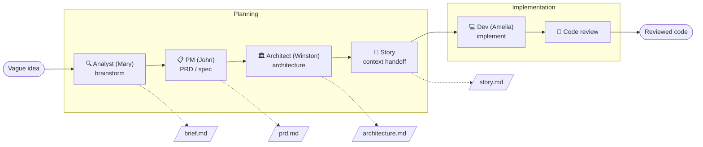

If the only way you've ever worked with an AI is to _vibe code_ with it, which is to say you open the editor, type a prompt, and keep whatever looks roughly right, then this is the post I wish someone had handed me back when I was doing exactly that. It isn't another argument about why spec-driven development is better, because I already made that case [here](/p/dont-be-mad-bmad-instead/); it's simply one complete pass through a real workflow, with the actual commands, so that you can see for yourself what the whole thing looks like from the inside.

Together we'll build one small feature with [BMAD](https://github.com/bmad-code-org/BMAD-METHOD), taking it all the way from a vague idea to reviewed code, and although the example is deliberately thin it is also complete, running the full sequence of brainstorm → spec → architecture → story → implementation → review without waving our hands over any of the parts that usually get skipped, so that by the end you can see exactly where the friction lives and what it buys you in return.

If you've never met the BMAD agents before, the [previous post](/p/bmad-meet-the-crew/) introduces the crew, and while you don't strictly need it in order to follow along here, it does help to know that "John" is a product manager and "Amelia" is a developer rather than people I actually work with.

The example is a URL shortener where links can expire. All the artifacts you'll see below are illustrative snippets from that walkthrough.

## The feature (and the trap)

Here's the feature: **a URL shortener where links can expire.**

Now watch how a vibe-coding session usually starts, because you'd open a chat and type something like this:

> Build me a URL shortener in [your stack]. Links should be able to expire.

That prompt _feels_ complete, but it really isn't, because it's a specification riddled with holes, and the AI is going to quietly fill every one of those holes with a guess that you never actually got to see it make, so it's worth counting them:

- **When does a link expire?** After a fixed TTL? At an absolute timestamp you pass in? After N clicks? "Expire" is three different features.
- **What happens when someone hits an expired link?** A `404`? A `410 Gone`? A redirect to a "this link expired" page? These are _observably different_ behaviors, and a caller integrating with you will build against whichever one you pick.
- **Do we count clicks?** If expiry can be click-based, you need a counter. If it can't, you probably still want analytics. That's a storage decision hiding inside a one-line prompt.
- **What's the ID scheme?** Random short codes? Collisions? Custom aliases?

Vibe coding doesn't make any of these decisions go away, it simply arranges for _someone else_ to make them silently and invisibly at generation time, and then it hands you back a pile of code that you now have to reverse-engineer in order to discover what was actually decided on your behalf. So when the "expired link returns 404" bug report lands on your desk three weeks later, you'll find yourself debugging a decision that nobody ever consciously made in the first place.

Spec-driven development, at its core, is really just this: you **make the decisions before you write the code, on purpose, and in a place where you can actually see them**, and BMAD is simply one way of running that process with the AI working inside the loop with you rather than against you.

Let's run it.

## The mental model, in 30 seconds

Two things to hold in your head before we start:

1. **BMAD is a team of agents rather than a single assistant.** Each one is a persona with a specific job to do, so there's an analyst who interrogates the idea, a product manager who writes the requirements, an architect who makes the technical calls and a developer who implements them, and you move between these personas deliberately as the work progresses. In the commands that follow, every phase can be run either by summoning the persona directly with `/bmad-agent-*` or by invoking its underlying workflow with `/bmad-*`, and you should feel free to use whichever of the two you prefer.
2. **The real output of the early phases is not code at all, it's artifacts.** These are things like a brief, a PRD, an architecture document and a story file, all of them plain markdown that lives right there in your repository, and the code itself only arrives _last_, sitting downstream of a set of documents that you can read, review and version like anything else.

Broadly speaking there are two stages to all of this, a **planning** stage in which you work out what to build and how to build it, followed by an **implementation** stage in which you actually build it, and the whole point of the arrangement is that planning leaves behind durable, reviewable artifacts which then carry all of their context forward into implementation, so that the AI writing your code is working from a genuine spec rather than from a vibe.



Everything drawn with a dotted line there is a file that ends up in your repository, and that is precisely the part of the process that vibe coding never produces.

## Phase 1, Brainstorm: drag the hidden decisions into the light

We start with Mary, the analyst, and a brainstorming session:

```text
/bmad-agent-analyst      # then pick the brainstorming capability
# or go straight to it:
/bmad-brainstorming
```

The move here is genuinely counterintuitive if you're accustomed to prompting an AI for output, because **you're not asking it for an answer at all, you're asking it to interrogate you**, and Mary's entire job in this session is to ask you the questions that you quietly skipped over. This is exactly the moment where those four hidden decisions from the trap section earlier stop being invisible and start being things you have to answer for.

A brainstorm on "URL shortener with expiring links" should surface, at minimum: which _kinds_ of expiry we actually want (TTL vs absolute date vs click-count), the expired-link behavior as a deliberate choice, whether click tracking is a feature or just a mechanism, and the ID/alias scheme.

The artifact that comes out of this phase is a **brief**, and this really is the part worth staring at for a moment, because it doesn't merely list the things we intend to build; it also records the things we have deliberately decided _not_ to build, so that those decisions leave a paper trail behind them instead of quietly evaporating. Here's the heart of an example `brief.md`:

```markdown
## Decisions (made on purpose, for v1)

- **Expiry model: absolute timestamp.** A link carries an optional `expires_at`
  (UTC instant). No `expires_at` means the link never expires.
- **Expiry is inclusive.** At exactly `expires_at`, the link is already expired.
- **Behavior on an expired link: `410 Gone`,** with body `{ "reason": "expired" }`.
  Not a `404`, not a `302` to a landing page.
- **ID scheme: 7-character base62 random code,** with collision-retry.

## Explicitly out of scope for v1 (deferred, not forgotten)

- Relative / TTL expiry ("expire 24h after creation").
- Click-count expiry, click tracking / analytics.
- Custom aliases, custom "this link expired" landing pages.
```

Take a good look at that "out of scope" list, because every single line in it is a decision that a vibe-coding prompt would have made _for_ you, silently and without asking, whereas here every one of them is on the record, deferred deliberately rather than forgotten by accident.

If you want a more formal artifact than a brainstorm dump:

```text
/bmad-product-brief
```

Notice what has already happened here, because we haven't yet written a single line of code and we have already caught three or four decisions that vibe coding would otherwise have made for us essentially at random.

## Phase 2, PRD: turn decisions into requirements you can check

Now we switch to John, the product manager, to produce a Product Requirements Document.

```text
/bmad-agent-pm
# or the workflow directly:
/bmad-prd
```

John's job is to take something like "we decided that links expire by absolute timestamp and that expired links return `410 Gone`" and convert it into requirements that are precise enough that you could hand them to a complete stranger and expect the right thing to come back, and this is the point at which the fuzzy brainstorm finally hardens into something resembling a contract.

Here's an example FR-3 from `prd.md`:

```markdown
### FR-3: Accessing an expired link

- **Given** a short link whose `expires_at` is at or before now
- **When** a client requests `GET /{code}`
- **Then** the service responds `410 Gone`
- **And** the response body includes a machine-readable `reason: "expired"`
- **And** no redirect (`3xx`) is issued

Non-goals for v1: custom "expired" landing pages, per-link grace periods.
```

Read that through and notice what has changed, because the `410` decision is now **written down, reviewable and testable**, which means that a month from now the question "why does it return 410?" has an actual answer with a paper trail attached to it, and that really is the whole difference between a decision and an accident.

If you want the requirements distilled into a tighter, machine-oriented contract for the downstream agents, BMAD has a dedicated step:

```text
/bmad-spec
```

## Phase 3, Architecture: the technical calls, made once

Winston, the architect, takes the _what_ that we've established so far and decides the _how_, and for a feature this small the right instinct is to keep the whole thing thin, because you really don't need a forty-page architecture document for a URL shortener, you only need the handful of decisions that would be genuinely expensive to get wrong:

```text
/bmad-agent-architect
# or:
/bmad-architecture
```

The decisions worth pinning down here:

- **Storage:** how do we persist `code → target_url + expires_at`? Key-value store, relational table, in-memory for a toy?
- **Expiry enforcement:** lazy (check `expires_at` on read) or active (a sweeper that deletes expired rows)?
- **ID generation:** how we mint short codes and handle collisions.

The lazy-versus-active call is the one with real teeth in it, and here is how `architecture.md` records that call, capturing both the decision _and_ its consequence:

```markdown
### Expiry enforcement: lazy (checked on read)

- **Chosen: lazy.** Simplest correct behavior; no scheduler, no clock daemon.
- **Consequence, on purpose:** an expired link's record still _exists_ in the
  store until something evicts it. `resolve` must therefore never assume
  "present in store" means "live". It must evaluate expiry every time.
- Rejected for v1: active sweeping. Adds a scheduler we don't need yet.
```

Writing down the _consequence_, namely that "present in store" does not mean "live", is the part that pays off later on, because it's the exact invariant that the implementation is going to have to honor, and it has been stated in plain language before a single line of `resolve` even exists. The output of all this is an `architecture.md` sitting in your repository, reviewable and versioned, the kind of thing a teammate can simply read instead of having to reverse-engineer it back out of the code.

## Phase 4, The story: packaging context for the implementer

This is the phase that vibe coders have quite simply never seen, and it also happens to be the one that makes the whole method actually work.

```text
/bmad-create-epics-and-stories   # break the PRD into epics + stories
/bmad-create-story               # generate the next story with full context
```

A **story** is a single, self-contained unit of work, but the genuinely important part is _what's actually in it_, because a BMAD story file is nothing like a Jira ticket that carries a title and a single sentence of description. It is instead a complete context package, gathering together the relevant requirements, the architectural decisions that happen to apply, the acceptance criteria and pointers to the exact files that are in play, and it is written in such a way that an agent, or for that matter a human, can pick it up completely cold and still have everything they need to get started.

Here's an example `story-1.3`:

```markdown
# Story 1.3 — Return 410 for expired links

## Context

Implements FR-3 (see prd.md). Expiry is enforced lazily on read, and the
boundary instant is inclusive (now >= expires_at ⇒ expired) — both are
architecture decisions. `now` is injected into resolve() so expiry stays
deterministic in tests.

## Acceptance criteria

- [ ] resolve of a link whose expires_at <= now → 410, body {"reason": "expired"}
- [ ] no 3xx is produced for an expired link
- [ ] a link with expires_at in the future still redirects 302 (regression guard)
- [ ] a link with expires_at is None still redirects 302 (never expires)
- [ ] at exactly expires_at, the link is already expired (boundary is inclusive)
- [ ] unknown code still returns 404 (unchanged)

## Files in play

- shortener/service.py (add `now` param to resolve; add expiry branch)
- shortener/http_app.py (supply now = datetime.now(timezone.utc))
- tests/test_service.py (expiry + regression cases)
```

Notice how the criteria carry all of the upstream decisions through verbatim, including the inclusive boundary, the "no 3xx" rule and the regression guards, so that nothing at all has been left open to interpretation.

Why does any of this matter so much? It matters because when you hand _this_ to an implementer there is genuinely nothing left for them to guess at, since the `410` is no longer a coin flip but an acceptance criterion with a regression guard sitting right next to it, and the story turns out to be the vehicle that carries every last decision you made back in phases 1 through 3 forward into the code itself.

With the story now in hand, all of the planning artifacts are finally in place, and before writing any code at all it is worth taking a moment to check that they actually line up with one another:

```text
/bmad-check-implementation-readiness
```

This validates that your PRD, your architecture and your stories all agree with one another before anyone starts implementing anything, which is really the spec-driven equivalent of the old carpenter's rule to measure twice and cut once.

## Phase 5, Implementation: now, finally, code

Only now do we finally sit down to write code, and by this point the act of "writing the code" has become almost mechanical, precisely because every meaningful decision was already made further upstream.

```text
/bmad-agent-dev
# or run a story end to end:
/bmad-dev-story
```

Amelia, the developer, works _from the story_, implementing against the acceptance criteria one by one, and the real tell that you are no longer vibe coding is that she can check her own work against a written definition of done rather than against her own intuition. Whenever she finds herself uncertain about something, the answer is already sitting in the story, or in the PRD, or in the architecture document, and never in a guess.

The entire implementation of story 1.3 is this diff to `resolve`, and because the story pre-decided everything the change is almost mechanical:

```diff
-def resolve(store: InMemoryStore, code: str) -> Resolution:
-    """Resolve a short code to a redirect or an error (FR-2, FR-4)."""
+def resolve(store: InMemoryStore, code: str, *, now: datetime) -> Resolution:
+    """Resolve a short code to a redirect or an error (FR-2, FR-3, FR-4).
+
+    Expiry is evaluated lazily on every read: a record present in the store is
+    not necessarily live. The boundary is inclusive — at exactly ``expires_at``
+    the link is already gone.
+    """
     link = store.get(code)
     if link is None:
         return Resolution(status=404, body={"reason": "not_found"})
+    if link.expires_at is not None and link.expires_at <= now:
+        return Resolution(status=410, body={"reason": "expired"})
     return Resolution(status=302, location=link.target_url)
```

It comes down to two lines of logic, but the part worth looking at is the docstring, because it cites FR-3, the lazy-expiry decision and the inclusive boundary all together, and it can do so only because all three of them came _down the pipe_ from the artifacts that preceded it. The code, in other words, is not the place where any of those decisions were made, it is simply the place where they were finally applied.

Contrast this with the ordinary vibe-coding loop, where you prompt the model, eyeball whatever output comes back and then re-prompt it whenever the result is wrong, because here the loop instead becomes implement against the criteria, verify against the criteria and you're done. The AI is of course still doing all of the actual typing, but this time it is typing toward a target that you defined in advance rather than toward some vague sense of "looks about right."

## Phase 6, Review: verify against the spec, not against vibes

```text
/bmad-code-review
```

The review is what closes the loop, and here is the quiet superpower that comes from having done all of the upstream work first, which is that **you can now review against the spec itself**. A question like "does the expired-link path return `410` in the way that FR-3 requires?" has become a plain yes-or-no question, whereas without a spec to lean on, code review tends to degenerate into "looks fine to me", which is really just vibe coding wearing a blazer.

And this is exactly where the whole approach earned its keep, because the review caught a real defect, and that defect was only catchable in the first place _precisely because there was a spec to check the code against_:

> **Finding:** `architecture.md` states an invariant — "timestamps are UTC-aware; naive datetimes are a caller error" — but nothing enforces it. `create_link` happily accepts a naive `expires_at`. At resolve time, `expires_at <= now` then compares a naive datetime against the adapter's aware `now` and raises `TypeError: can't compare offset-naive and offset-aware datetimes`. FR-3 promised a `410`; the caller gets an unhandled `500` instead.

That single bug is the whole argument for spec-driven development compressed into one example, because a vibe-coded shortener would almost certainly have carried _the very same defect_, and yet with no `architecture.md` invariant for it to violate, the reviewer would have had nothing to notice it against in the first place. The spec did more than merely document the decision, it turned what would have been a silent 500 into a visible finding, and the fix itself came down to a three-line guard in `create_link` that fails fast with a clear error, together with a regression test, and because the invariant had been written down all along, the question "is this actually fixed?" is once again a simple yes-or-no.

## What actually just happened

Step back and look at what we've produced:

- `brief.md`: the ideas and the decisions we deferred
- `prd.md`: the requirements, testable
- `architecture.md`: the technical calls
- `story-1.3.md`: the context package that drove the code
- the code itself, plus tests

The code is the _smallest_ artifact in that entire list, and it is also the very last one we made, and that inversion is really the whole point of the exercise. In vibe coding the code is the first and only artifact you ever produce, so every decision ends up trapped inside it and left undocumented, whereas in spec-driven development the code is instead a _consequence_ of everything else, with the decisions themselves living in readable documents and the code standing as nothing more than their current implementation.

This is exactly why the friction turns out to be worth it, and in a real sense the friction _is_ the value, because every question that Mary asked, every requirement that John pinned down and every call that Winston made are all decisions that would otherwise have been made silently by an autocomplete, at twice the speed and none of the visibility.

You didn't actually slow down at all, you simply moved the thinking to the front of the process where it happens to be cheap, instead of leaving it for the debugger later on where it is always expensive.

## Try it on something small

Don't go and start with your production monolith. Pick a feature that is exactly this size, small enough that you can finish it in a single sitting and yet real enough that it still hides a few decisions inside it, and then run the full loop through once from beginning to end:

```text
/bmad-brainstorming        # surface the decisions
/bmad-prd                  # write them down
/bmad-architecture         # make the technical calls
/bmad-create-story         # package the context
/bmad-dev-story            # implement against it
/bmad-code-review          # verify against the spec
```

The first time you go through it, the whole process will feel like pure overhead, and you should do it anyway, because somewhere around the story phase, at the moment when you hand the implementer a spec and get back exactly what you asked for, it quietly stops feeling like overhead and starts feeling like the thing you had been missing all along.

That's the moment the lever stops being a slot machine.

---

_Want the backstory on why I stopped vibe coding? Start with [Don't be mad, BMAD instead](/p/dont-be-mad-bmad-instead/). Want to meet the agents properly? [Here's the crew](/p/bmad-meet-the-crew/). Want to see the method on a bigger project? [Building TODOdoro](/p/bmad-in-action-building-tododoro/)._
